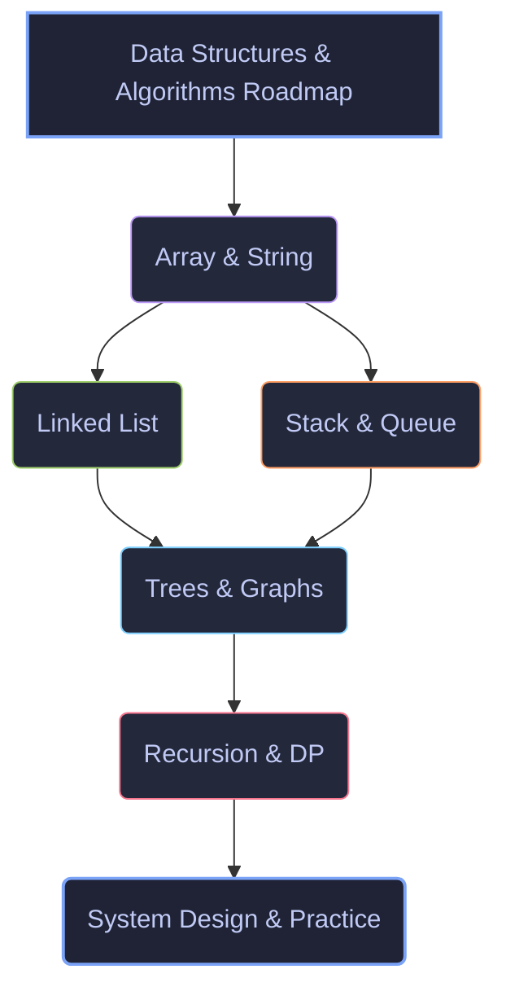

# Study and Code

This repository serves as a centralized hub for daily coding practice, algorithms, AI agent development, and technical learning logs to document my enhancement in software engineering.

---

## Data Structures & Algorithms Roadmap

Here is a visual roadmap of my active DSA study progression:



---

## Directory Structure

* **`dsa/`** &nbsp;&middot;&nbsp; Daily structured LeetCode problem solutions with both Python and Java implementations.
* **`study-notes/daily-logs/`** &nbsp;&middot;&nbsp; Daily enhancement logs tracking study progress, code milestones, and self-reflection.
* **`study-notes/communication/`** &nbsp;&middot;&nbsp; Technical communication writeups, API design documentation, and system design patterns.
* **`ai-agents/`** &nbsp;&middot;&nbsp; Architecture designs, prompt engineering pipelines, and agent trees.
* **`claude-updates/`** &nbsp;&middot;&nbsp; Integration notes, Claude API updates, and developer community updates.
* **`academic-projects/`** &nbsp;&middot;&nbsp; Swing applications, console games, and core Java/SQL projects.

---

## Daily Log Automation
A Python utility `log_activity.py` is included in the root directory to automate file generation and Git commits for daily progress. 

To log a new entry:
```bash
python log_activity.py
```

---
Proprietary software and practice logs of Sriram S &middot; [sriram.website](https://sriram.website)
